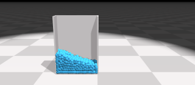

# Understanding Particle Dynamics for Manipulating fluids and semi-fluids

**ICLR 2019**
[[website]](http://dpi.csail.mit.edu/) [[paper]](http://dpi.csail.mit.edu/dpi-paper.pdf) [[video]](https://www.youtube.com/watch?v=FrPpP7aW3Lg)

## Demo

### Simulation

Rollout from our learned model

  

  

## Updates

**(2020-9-8) An improved version of DPI-Net**

You may also take a look at the following repo that we released for training and evaluating the particle dynamics networks, where we made some modifications on top of DPI-Net to make long-term predictions more stable.

[https://github.com/YunzhuLi/VGPL-Dynamics-Prior](https://github.com/YunzhuLi/VGPL-Dynamics-Prior)

This section discussed the difference between DPI-Net and VGPL-Dynamics-Prior.

[https://github.com/YunzhuLi/VGPL-Dynamics-Prior#difference-between-this-repo-and-dpi-net](https://github.com/YunzhuLi/VGPL-Dynamics-Prior#difference-between-this-repo-and-dpi-net)

## Note -  Install the PyFlex github repo as it will be used extewnsively in this project

## Installation

Clone this repo:
```
git clone https://github.com/YunzhuLi/DPI-Net.git
cd DPI-Net
git submodule update --init --recursive
```

### Install Dependencies if using Conda
For Conda users, we provide an installation script:
```
bash ./scripts/conda_deps.sh
```

### Install PyFleX

Add environment variables

    export PYFLEXROOT=${PWD}/PyFleX
    export PYTHONPATH=${PYFLEXROOT}/bindings/build:$PYTHONPATH
    export LD_LIBRARY_PATH=${PYFLEXROOT}/external/SDL2-2.0.4/lib/x64:$LD_LIBRARY_PATH

If you are using Ubuntu 16.04 LTS and CUDA 9.1, you can use the following command for compilation.

    cd PyFleX/bindings; mkdir build; cd build; cmake ..; make -j

If you are using **newer versions** of Ubuntu or CUDA, we provide the pre-built Docker image and Dockerfile for compiling PyFleX. After compilation, you will be able to use PyFleX outside docker. Please refer to our [Docker](https://github.com/YunzhuLi/PyFleX/blob/master/bindings/docs/docker.md) page. Note that you do not have to reclone PyFleX again as it has been included as a submodule of DPI-Net.

### Test PyFleX examples

    cd ${PYFLEXROOT}/bindings/examples
    python test_FluidFall.py


## Evaluation

Go to the root folder of `DPI-Net`. You can direct run the following command to use the pretrained checkpoint.

    bash scripts/eval_FluidFall.sh
    bash scripts/eval_BoxBath.sh
    bash scripts/eval_FluidShake.sh
    bash scripts/eval_RiceGrip.sh

It will first show the grount truth followed by the model rollout. The resulting rollouts will be stored in `dump_[env]/eval_[env]/rollout_*`, where the ground truth is stored in `gt_*.tga` and the rollout from the model is `pred_*.tga`.


## Training

You can use the following command to train from scratch. **Note that if you are running the script for the first time**, it will start by generating training and validation data in parallel using `num_workers` threads. You will need to change `--gen_data` to `0` if the data has already been generated.

    bash scripts/train_FluidFall.sh
    bash scripts/train_BoxBath.sh
    bash scripts/train_FluidShake.sh
    bash scripts/train_RiceGrip.sh

## Citing DPI-Net

If you find this codebase useful in your research, please consider citing:

    @inproceedings{li2019learning,
        Title={Learning Particle Dynamics for Manipulating Rigid Bodies, Deformable Objects, and Fluids},
        Author={Li, Yunzhu and Wu, Jiajun and Tedrake, Russ and Tenenbaum, Joshua B and Torralba, Antonio},
        Booktitle = {ICLR},
        Year = {2019}
    }

